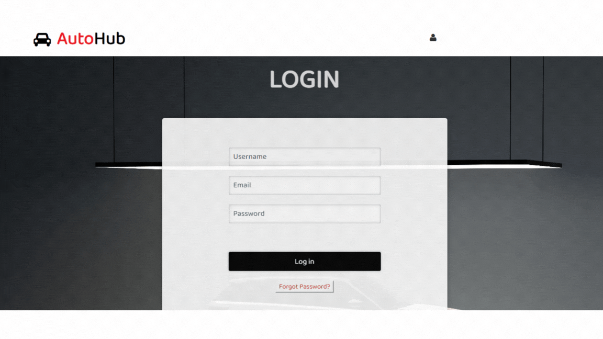

# Virtual-Car-Customization-Studio-and-Automotive-Marketplace

🚗 **An interactive online marketplace for automotive parts and customization!**  

## **🛠️ Project Overview**  
This project is a **virtual car customization studio** and **automotive marketplace** built using **Flask, HTML/CSS, and MSSQL**. It follows **Software Design Principles** and the **Client-Server Model**, enabling seamless interactions between **buyers, sellers, and suppliers**.  

### **✨ Features**
- 🏪 **Automotive Marketplace** – Buy & sell car parts efficiently.  
- 🎨 **Car Customization Studio** – Visualize modifications before purchase.  
- 🛒 **Buyer-Seller-Supplier Interaction** – Direct communication for better deals.  
- 💬 **Community Forum** – Users can post content and write comments.  
- 🔍 **Advanced Search & Filtering** – Find exactly what you need.  
- 🖥️ **Responsive UI** – Accessible on both desktop & mobile devices.  

---

## **📂 Tech Stack**
| Component        | Technology Used  |
|-----------------|-----------------|
| **Backend**      | Flask (Python)  |
| **Frontend**     | HTML, CSS, JavaScript |
| **Database**     | Microsoft SQL Server (MSSQL) |

---

## **📧 Developer**
ariba-arshad
